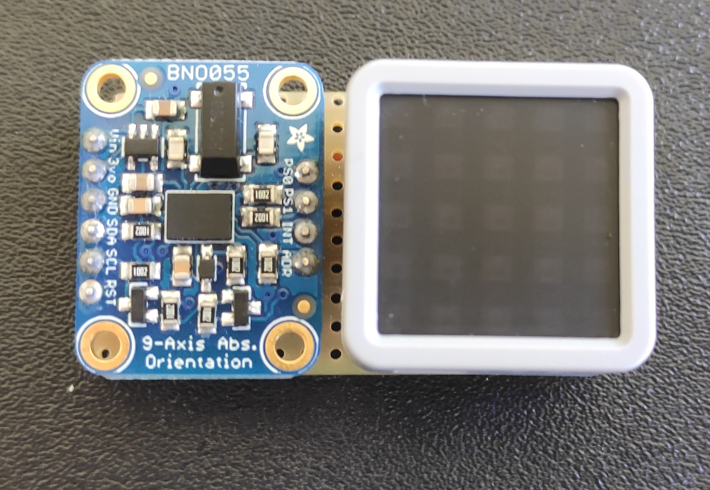

# myAGV + IMU

## Getting started
NOTE: This can only be tested or used inside CITIN-CPSLAB network, as it depends on MQTT Broker on Server aswell as ROS Master.

### myAGV Configuration
1. Open terminal in VNC 

2. Execute roslaunch for navigation

`roslauch navigation_demo navigation.launch`

3. Open new SSH terminal or VNC (don't close previous terminal)

4. Execute rosrun command

`rosrun imu_control control.py`

5. End

### IMU Configuration
1. Turn on ESP32
2. End

### Operation mode

The sensor in the user's hand consists of an ATOM ESP32-Pico microcontroller and
an IMU sensor. The Atom reads the inertial data from the IMU sensor and publishes it to the MQTT (Message Queuing Telemetry Transport) broker. The AGV, in turn, subscribes to the MQTT broker topic and checks the LIDAR sensor values to detect the presence of obstacles in the direction it is moving. When the AGV detects an obstacle with the LIDAR, it stops and waits until the obstacle is removed or the user changes direction. After checking that the path is clear, the AGV moves in the direction indicated by the IMU sensor.
Sensor with case | Sensor without case
--- | ---
|
